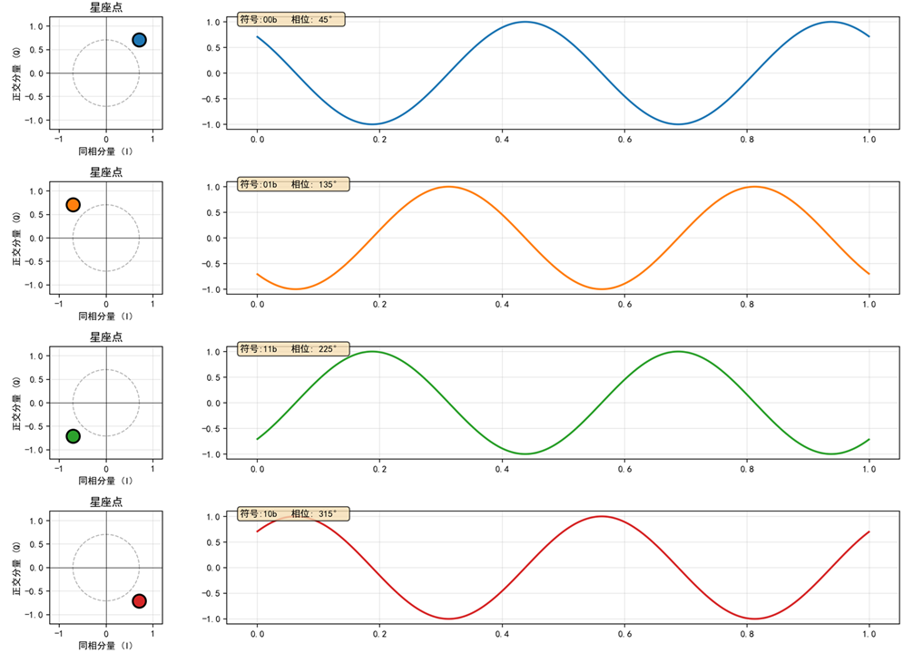

在现代通信系统中，无论是Wi-Fi(IEEE802.11)、4G/5G移动通信、卫星通信，还是光通信系统，OFDM（正交频分复用）都是一项基础技术。翻阅任何一本通信教材，你几乎都会看到这样一句话：

“OFDM调制可以通过IFFT（逆快速傅里叶变换）来实现。”

但这句话背后的直觉是什么？

为什么一个数学变换就能实现调制？

大多数教材的解释都充满了公式推导，令人烧脑。这里将把公式放一边，用直观、可视化方式，从最简单的QPSK调制入手，逐步揭示OFDM与IFFT的联系。

1. 从 QPSK 调制说起

要理解OFDM，我们先回到单载波的世界。

单载波调制中，QPSK（正交相移键控）是最基础、最常见的相位调制方式之一。在 QPSK中：

- QPSK 星座图上共有4个不同相位。
- 每个符号携带两个比特，换句话说，每两个比特被映射为星座上的一个复数点。
下图展示了QPSK星座图中的四个符号点。
  
图1：QPSK星座图

### QPSK 映射表
| 符号比特 | 复数表示 |
|---------|----------------------|
| 11      | −0.707 − 0.707j |
| 01      | −0.707 + 0.707j |
| 01      | −0.707 + 0.707j |
| 00      | +0.707 + 0.707j |

图中，每个点代表一种两比特组合，它们的复数表示包含了幅度与相位信息，决定了调制后的载波的波形。
比如对符号比特11b，它的复数表示是（-0.707 - 0.707j），它的波形是：

也就是下图中的第3个正弦波。下图展示了00，01，11，10每个符号对应的波形。为了便于观察，我们为每个符号绘制了两个周期的波形，实际上调制的时候，只用一个正弦波周期就够了。注意，它们的频率一致，幅度一致，只有相位不同。

图2：四种QPSK的波形示意

假设要发送一个字节的数字：0x1E（二进制位00 01 11 10b）。

使用QPSK调制，我们将它按两位一组，拆分为4个符号：00，01，11，10。

按照上面图2中每个符号对应的波形，取正弦波的一个周期，将它们拼接起来，依次发送，便得到了连续的QPSK调制波形。如下所示：

图3：连续 QPSK 符号波形

可以看到，QPSK调制的本质，就是利用复数里的相位信息，来调制单个载波的正弦波。

2. OFDM：让多个载波一起工作

OFDM 的核心思想是：把高速数据流拆成多个低速的子数据流，并把它们分别调制到一系列相互正交的子载波上，每个子载波可以独立使用BPSK、QPSK、16QM、64QAM等不同的调制方式，这里我们仍然使用QPSK。

举例：

假设系统中有 8 个子载波，频率分别为 1 Hz、2 Hz、...、8 Hz。
发送8个字节数据：0xD4, 0xAA, 0xB5, 0xA9, 0xBF, 0xEC, 0xC0, 0xD6
在QPSK下，每个字节（8比特）被拆分为4个符号。如果我们定义一帧OFDM信号包含4个符号周期，那么这一帧就承载了8（子载波）× 4（符号）= 32个QPSK符号。也就是说，8个字节被同时调制到8个子载波上，每个子载波负责传输一个字节。

下表展示了各字节的 QPSK 调制结果。其中，不同的颜色标识出了二进制比特与对应的符号复数表示：

图4：各字节的 QPSK 在不同子载波的调制

将这 8 组符号分别调制到 1~8 Hz 的载波上，我们得到 8 条调制波形：

图5：8个子载波的调制波形

再将这8个子载波信号相加，就得到一帧OFDM的综合信号：

图6：OFDM 合成波形

这就是典型的多载波调制，它携带了8个字节的数据。将它们再调制到射频载波（比如2GHz），就可以发射出去了。如果用模拟方式实现，大致是下面的电路形式：

图7：模拟多载波调制器示意图

如果不是8个子载波，而是1024个，这个电路会极其复杂、昂贵。

3. 思路转变：OFDM调制用IFFT实现

现在，迎来关键的思路转变。首先，回顾一下数字信号处理中的时域-频域对偶关系：

- 对时域的离散信号做FFT，输出是频域复数谱（幅度和相位）。
- 对频域的复数谱做IFFT，输出的是时域的离散信号。

让我们回到上面的多载波调制场景。从上面表格中，我们把“符号1”这一列的复数对取出来观察一下：

图8：取出“符号1”这一列

这一列的物理含义是什么呢？其实前面已经提到过了：

- 第一行的（-0.707−0.707j）表示的是1Hz子载波的幅度和相位。
- 第二行的（ 0.707−0.707j）表示的是2Hz子载波的幅度和相位。
- …
所以，这一列数据本质上就是子载波信号在频域上的复数谱表达。

那么，对这一列数据做IFFT，输出是什么呢，输出正是这些子载波叠加后，在第一个符号周期内的时域离散采样点。

对“符号1”这一列做IFFT，得到第一个符号周期的采样；对“符号2”这一列做IFFT，得到第二个符号周期的采样；依此类推。最后将所有IFFT输出的时域采样点按顺序拼接起来，就得到了完整一帧、4个周期OFDM信号在时域的离散波形：

图9：64点IFFT 输出的 OFDM 时域信号

观察这个图形，跟前面图6对比，是不是很像？

让我们将IFFT输出的波形（图9）与模拟电路合成的波形（图6），绘制在一起进行对比：

图10：IFFT输出与多载波合成信号的对比
二者是完全重合、一致的。

4. 总结

换句话说：

每个子载波的复数符号，就是频域上的一个采样点。
IFFT的输出，就是所有子载波叠加后的合成信号在时域的采样。
于是，我们不需要再实现图7中的模拟调制电路，取而代之的是，在数字域，我们只需对频域数据执行一次IFFT运算，就能直接得到合成信号的时域离散采样。

将IFFT 输出的时域离散采样信号通过DAC数模转换）输出，就得到了可以直接上变频并发射的模拟信号。

这就是为什么说：OFDM调制= IFFT运算
